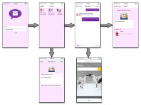

# MorMessages

My final project submission for the Udacity *iOS Developer Nanodegree*, and the foundation for
a fun hobby project to maintain and improve after that. One goal I had in building this 
project was to create a sandbox environment to experiment with technologies supporting real-time 
user communication, and more specifically I wanted to work with Websockets on iOS.

## Table of Contents

* [App Overview](#app-overview)
* [Application Workflow](#application-workflow)
* [Build Notes](#build-notes)
* [Application Core Design](#application-core-design)
    * [MorMessages Networking APIs](#mormessages-networking-apis)
    * [MorMessages Persistence APIs](#mormessages-persistence-apis)
* [Implementation Details](#implementation-details)
    * [Login View](#login-view)
    * [Forum View](#forum-view)
    * [Messages View](#messages-view)
    * [Details View](#details-view)
    * [New Forum View](#new-forum-view)
    * [Web Browser View](#web-browser-view)

## App Overview

The **MorMessages** application is designed to support forum discussion with real-time conversations
 among users online and interacting with the app. The user workflow design is very similar to Apple's
 *Messages* application available by default on any iPhone.

The application is a client to the **mormessages** server application, also available on GitHub at
[morbrian/mormessages](https://github.com/morbrian/mormessages). Both the client and the server are
actively developed and every attempt is made to keep the two in sync, but as both projects are in
their infancy, expect significant changes over time.

By default, the application connects to a public intallation of the **mormessages** server, so there
is no requirement to do any work with the server project to use the **MorMessages** iOS application.

## Build Notes

The **MorMessages** application has no external dependencies and can be built with XCode and run
in the simulator or on any device.

The **MorMessages** application comes with a handful of unit tests designed to test the interaction
between the application and the server API. These tests will generate a number of garbage forums and
messages on the server and are most likely not worth running, but you are welcome to give them a try.

## Application Workflow

The basic outline of the application is depicted in the diagram below.

Working from left to right in the first row, then left to right again on the bottom row,
the following describes the purpose of each view.

1. **Login Screen** Enables user to authenticate

2. **Forum View** Presents users with a list of forums.

3. **Messages View** Permits the user to view and send messages within a chosen Forum.

4. **Details View** Presents details about when the forum was created and who created it.

5. **New Forum View** Enables the user to create a new forum topic.

6. **Web Browser** Enables the user to choose a link to share as a forum message.

## Application Core Design

The application is comprised of several custom components designed to provide the core functionality of the app, independent of the UI design.

### MorMessages Networking APIs

These are the main components used by the application for communicating over the network.

* **iOS Core Foundation:** baseline network capabilities instrinsic to iOS.
* **WebClient:** thin layer of utility functions used to simplify building and executing *HTTP* request calls.
* **ForumService:** thin layer specific to the `mormessages` network service.
* **WebSocket:** api for working with Websockets, from the project [tidwall/SwiftWebSocket](https://github.com/tidwall/SwiftWebSocket)
* **Reachability:** api providing notification of changes in network connectivity status from [Apple Reachability](https://developer.apple.com/library/ios/samplecode/Reachability/Introduction/Intro.html)

The `mormessages` server uses a self-signed certificate to communicate over SSL, so the application
has an *Application Transport Security* exception to allow connections to `mormessages.morbrian.com`.

### MorMessages Persistence APIs

These are the main components used by the application for storing data locally.

* **CoreDataStackManager:** this is nearly identical to what XCode generates in the appdelegate, just isolated to a separate class.
* **ImageCache:** this is a class provided by *Udacity* as part of the *iOS Persistence* course.

The primary model classes are `Forum` and `Message`. Each of these extends from `BaseEntity` to 
help with polymorphic use of common attributes such as `createdBy` and `createdTime` for example.

## Implementation Details

The following sections describe some of the interesting highlights about how each view is implemented,
and what to watch for when trying out the application.

### Login View

The login view is just what it sounds like: it lest the user enter username/password to login.

The couple visual features it provides are:

* If login fails, an error description will appear as label text above the username entry.

* While network activity is in progress the `MorMessages` logo icon will spin in place.

### Forum View

The forum view provides a list of forums in a `UICollectionView`. The avatar icon of the user who 
created the forum appears on the top left of each forum tile.

Interactive features of this view include:

* Only the most recent 100 forums are listed at first.
* Additional forums are fetched from network service as user scrolls down.
* User may pull down further when at the top of the list to refresh and get any more recent forums available.

### Messages View

The messages view shows messages in a `UITableView`. Messages sent by other users appear on the left
and are identified by the user's robohash avatar. Messages sent by the current user appear on the right
in purple. Two specialized `UITableViewCell Identifiers` were used to layout this view.

This view relies on websockets to provide realtime conversation capabilities to users currently
interacting in the forum.

Interactive features of this view include:

* Network status icon on top right (green-check or red-x).
* View scrolls to bottom when first shown to display most recent messages.
* Additional older messages may be fetched by pulling down when the top of the list is reached.

### Details View

The details view is a simple read-only view which diplays who created the forum, their avatar,
and the date-time of when the forum was created.

### New Forum View

The user can create a new forum with a title and description. The user can also choose to enter
a URL to an image icon representing the forum. If the user does not select an image, a random 
image is fetched based on the MD5 has of the Forum title.

Interactive features of this view include:

* Cannot create a forum with in inaccessible image URL.
* Random image based on hash of title text.

### Web Browser View 

The web browser view enables the user to browse to and choose a web URL to post as a message to the forum.

Interactive feature of this view include:

* Application Transport Security alert if tapping on unscure URL.
* Custom Search bar able to differentiate between search text and valid URLs.
